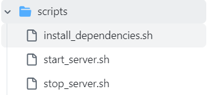

+++
title = 'Create buildspec.yaml'
date = 2024-09-07T19:01:58+07:00
draft = false
weight = 3
pre = "<b>4.1.2. </b>"
+++

### Create buildspec.yaml:

```bash
vi buildspec.yaml
```

```yaml
version: 0.2

phases:
    build:
        commands:
            - npm i && npm run build
artifacts:
    files:
        - "build/**/*"
        - "appspec.yml"
        - "scripts/**"
    name: "my-build-artifact"
cache:
  paths:
    - "node_modules/**/*"
```

Specifying:
-   **artifacts**: _Information about the build output artifacts for the build_
    -   **files**: _Determinedly what exactly folder, sub-folder, or file can be compressed zip in build output artifacts_
    -   **name**: _Name of build output artifacts_
        [More info!](https://docs.aws.amazon.com/codebuild/latest/userguide/build-spec-ref.html#build-spec-ref-syntax)
-   **npm i**: _install node modules to source from github_
-   **npm run build**: _command used to build react app_
-   **file**:
    -   **appspec.yml**: *using for codedeploy in ec2* 
        ```yml
        version: 0.0
        os: linux
        files:
        - source: /
            destination: /var/www/
        hooks:
        ApplicationStop:
            - location: scripts/stop_server.sh
            timeout: 300
            runas: root
        BeforeInstall:
            - location: scripts/install_dependencies.sh
            timeout: 300
            runas: root
        ApplicationStart:
            - location: scripts/start_server.sh
            timeout: 300
            runas: root
        ```
    - **script**: *using for appspec.yml*
      - 
      - Can reference in my code [github](https://github.com/longnnt/demo_ci-cd) or [reference appspec.yml use for Ec2/On-Premises](https://docs.aws.amazon.com/codedeploy/latest/userguide/application-revisions-appspec-file.html#add-appspec-file-server)
        

- Save buildspec to s3 created in [section](/pre-install/create-s3/#create-s3-bucket-using-cli)
  - Run this command ```aws s3 cp /path/to/source s3://bucket-name/ --recursive```
  - /path/to/source created in cloudshell
  - bucket-name ```codepipeline-ap-southeast-1-nntl-example```


