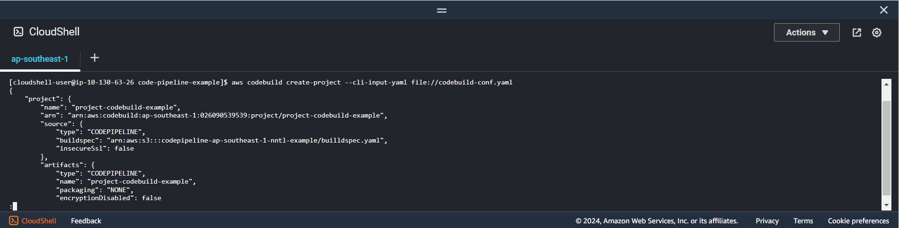

+++
title = 'Create AWS CodeBuild project'
date = 2024-09-07T19:01:58+07:00
draft = false
weight = 4
pre = "<b>4.1.3. </b>"
+++

### Create aws codebuild config:

```bash
vi codebuild-conf.yaml
```

```yaml
name: "project-codebuild-example"
source:
    type: "CODEPIPELINE"
    buildspec: "arn:aws:s3:::codepipeline-ap-southeast-1-nntl-example/builldspec.yaml"
artifacts:
    type: "CODEPIPELINE"
environment:
    type: "LINUX_CONTAINER"
    image: "aws/codebuild/amazonlinux2-x86_64-standard:5.0"
    computeType: "BUILD_GENERAL1_SMALL"
cache:
    type: "NO_CACHE"
logsConfig:
    cloudWatchLogs:
        status: "DISABLED"
    s3Logs:
        status: "DISABLED"
serviceRole: "arn:aws:iam::xxxxxxxxxx:role/CodeBuildRole"
```

Specifying:

-   **name**: _Name of codebuild project_
-   **source**: _Information about the build input source code for the build project_
-   **artifacts**: _Information about the build output artifacts for the build project._
-   **environment**: _Config build enviroment._ [Codebuild enviroment reference](https://docs.aws.amazon.com/codebuild/latest/userguide/ec2-compute-images.html)
-   **cache**: _Stores recently used information so that it can be quickly accessed at a later time._
-   **logsConfig**: _Using for logs s3Logs or cloudWatchLogs_
-   **serviceRole**: *Attach role we created in previous [section]([#21-create-service-role-for-codebuild](/creat-codepipeline/create-codebuild/create-role-codebuild/#2-create-iam-role-for-codebuild)).*
-   If you use more property or understand information, please use a reference document. [Cli create project codebuld!](https://awscli.amazonaws.com/v2/documentation/api/latest/reference/codebuild/create-project.html)
  
---
Run this command to create codebuild project ```aws codebuild create-project --cli-input-yaml file://codebuild-conf.yaml```

**Result**



