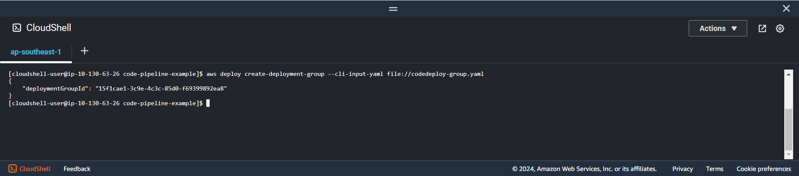

+++
title = 'Create deployment group'
date = 2024-09-07T19:01:58+07:00
draft = false
weight = 4
pre = "<b>4.2.3. </b>"
+++

```bash
vi codedeploy-group.yaml
```

```yaml
applicationName: "codedeploy-application"
deploymentGroupName: "codedeploy-group-name"
ec2TagFilters:
    - Key: "Name"
      Value: "ec2-server"
      Type: "KEY_AND_VALUE"
serviceRoleArn: "arn:aws:iam::xxxxxxxxxx:role/CodeDeployRole"
deploymentStyle:
    deploymentType: "IN_PLACE"
    deploymentOption: "WITHOUT_TRAFFIC_CONTROL"
```

Specifying:

-   **application**: _Application name created previous_
-   **deploymentGroupName**: _Name of deployment group_
-   **ec2TagFilters**: _Define which ec2 server created with name (ex: ec2-server)_
-   **serviceRoleArn**: _Service role created above_
-   **deploymentStyle**: _Information about the type of deployment, in-place or blue/green, that you want to run and whether to route deployment traffic behind a load balancer._

Ref: [Cli deployment group](https://awscli.amazonaws.com/v2/documentation/api/latest/reference/deploy/create-deployment-group.html)

```console
aws deploy create-deployment-group --cli-input-yaml file://codedeploy-group.yaml
```
**Result**



