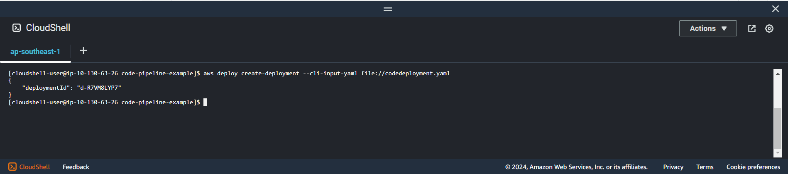

+++
title = 'Create deployment'
date = 2024-09-07T19:01:58+07:00
draft = false
weight = 5
pre = "<b>4.2.4. </b>"
+++

### Create deployment:


```bash
vi codedeployment.yaml
```
```yaml
applicationName: "codedeploy-application"
deploymentGroupName: "codedeploy-group-name"
revision:
    revisionType: "S3"
    s3Location:
        bucket: "codepipeline-ap-southeast-1-nntl-example"
        key: "my-build-artifact.zip"
        bundleType: "zip"
```

-   Define location using for deployment in s3 location and folder compressed zip exported in phase build

```console
aws deploy create-deployment --cli-input-yaml file://codedeployment.yaml
```
**Result**



