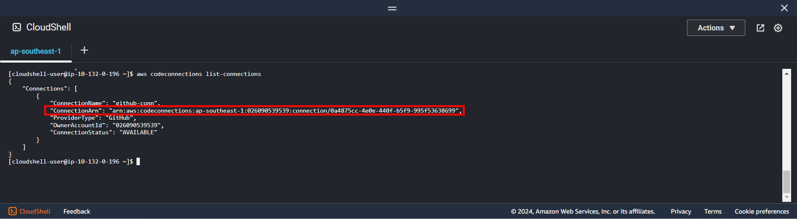
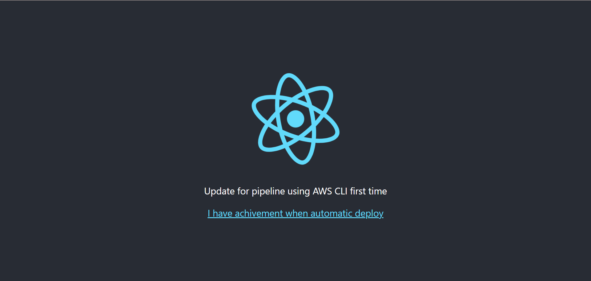
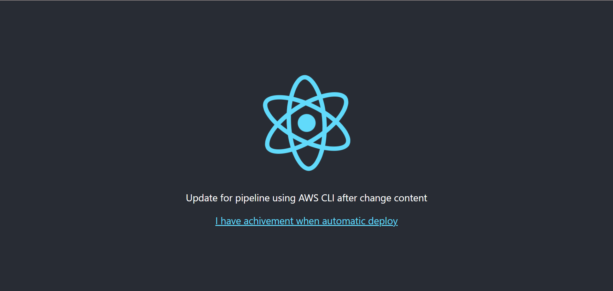

+++
title = 'Create pipeline config'
date = 2024-09-07T19:01:58+07:00
draft = false
weight = 3
pre = "<b>6.2. </b>"
+++
1. Create codepipeline config:
```bash
codepipeline-conf.json
```

```json
{
    "pipeline": {
        "name": "codepipeline-cli-example",
        "version": 1,
        "artifactStore": {
            "type": "S3",
            "location": "codepipeline-ap-southeast-1-nntl-example"
        },
        "executionMode": "QUEUED",
        "pipelineType": "V2",
        "roleArn": "arn:aws:iam::xxxxxxxx:role/CodepipelineRole",
        "triggers": [
            {
                "providerType": "CodeStarSourceConnection",
                "gitConfiguration": {
                    "sourceActionName": "get-code-from-git",
                    "push": [
                        {
                            "branches": {
                                "includes": ["develop"]
                            }
                        }
                    ]
                }
            }
        ],
        "stages": [
            {
                "name": "SOURCE",
                "actions": [
                    {
                        "name": "get-code-from-git",
                        "actionTypeId": {
                            "category": "Source",
                            "owner": "AWS",
                            "version": "1",
                            "provider": "CodeStarSourceConnection"
                        },
                        "runOrder": 1,
                        "configuration": {
                            "ConnectionArn": "arn:aws:codeconnections:ap-southeast-1:026090539539:connection/0a4875cc-4e0e-440f-b5f9-995f53638699",
                            "FullRepositoryId": "longnnt/demo_ci-cd",
                            "BranchName": "develop"
                        },
                        "outputArtifacts": [
                            {
                                "name": "MyApp"
                            }
                        ]
                    }
                ]
            },
            {
                "name": "BUILD",
                "actions": [
                    {
                        "name": "build-code-from-source",
                        "actionTypeId": {
                            "category": "Build",
                            "owner": "AWS",
                            "version": "1",
                            "provider": "CodeBuild"
                        },
                        "runOrder": 2,
                        "inputArtifacts": [
                            {
                                "name": "MyApp"
                            }
                        ],
                        "outputArtifacts": [
                            {
                                "name": "my-build-artifact"
                            }
                        ],
                        "configuration": {
                            "ProjectName": "project-codebuild-example"
                        }
                    }
                ]
            },
            {
                "name": "DEPLOY",
                "actions": [
                    {
                        "name": "deploy-from-codebuild",
                        "actionTypeId": {
                            "category": "Deploy",
                            "owner": "AWS",
                            "version": "1",
                            "provider": "CodeDeploy"
                        },
                        "runOrder": 3,
                        "inputArtifacts": [
                            {
                                "name": "my-build-artifact"
                            }
                        ],
                        "configuration": {
                            "ApplicationName": "codedeploy-application",
                            "DeploymentGroupName": "codedeploy-group-name"
                        }
                    }
                ]
            }
        ]
    }
}
```

Specifying:

-   **Stages**: _Stages use for pipeline (Source, Build, Deploy in this lab, can be increased more phase of project requires)_
-   **artifactStore**: _Location import/export artifact in phase if its defined inputArtifacts/outputArtifacts_
-   **triggers**: _trigger events to run pipeline (ex: push to branch 'develop' will run this pipeline). You can custom trigger events like push or pull_
-   **ConnectionArn**: *created in [section](/pre-install/connect-github/#create-connection-to-github-using-console) or run this command ```aws codeconnections list-connections ```*
      
- **roleArn**: *created in [section](/aws-codepipeline/create-codepipeline/create-role/)*
-   Ref:
    -   [Trigger](https://docs.aws.amazon.com/codepipeline/latest/userguide/pipelines-filter-cli.html)
    -   [Cli codepipeline](https://awscli.amazonaws.com/v2/documentation/api/latest/reference/codepipeline/index.html?highlight=codepipeline)

- Run this command ```aws codepipeline create-pipeline --cli-input-json file://codepipeline-conf.json```
---
### When command above run wait 2-3 minutes in first time deploy


**Result**


---
### Change content and update push code merge to develop branch

**Result**



