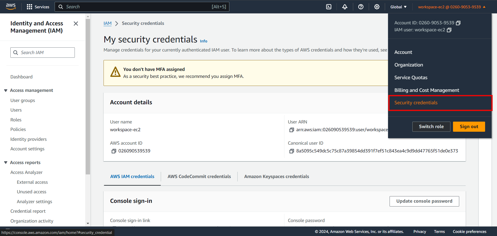

+++
title = 'Configure with Cloudshell'
date = 2024-09-07T19:01:58+07:00
draft = true
weight = 1
+++

#### Create access key in IAM Console:
   
- Then
   

-   Choose from top to bottom and click Next
    
-   Click create access key
    
-   Result after this
    
-   Open cloud shell
    -   
    -   Run command `aws configures`
    -   Copy access key and paste in cli
        
    -   Copy secret access key and paste in cli
    -   
    -   Press region default name (ex: ap-southeast-1)
    -   
    -   Enter 2 times and done this step
