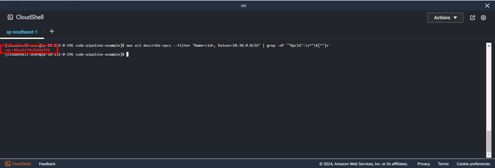
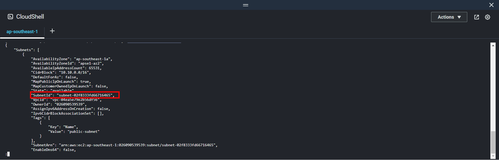
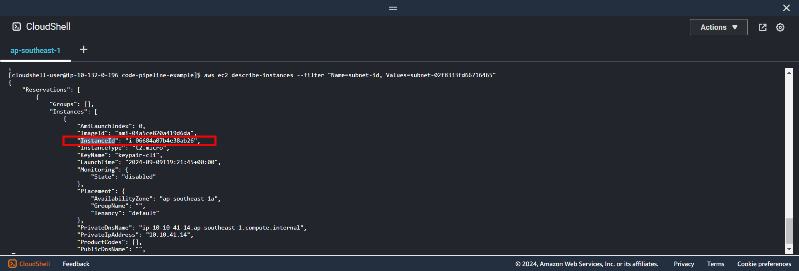
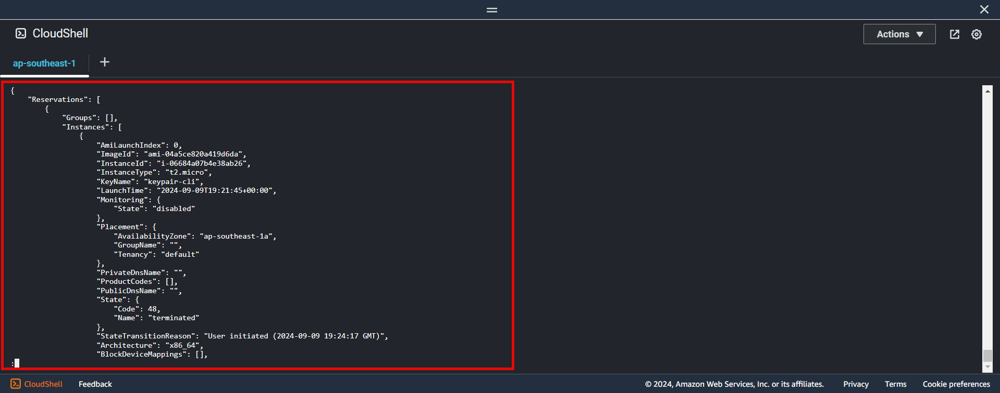
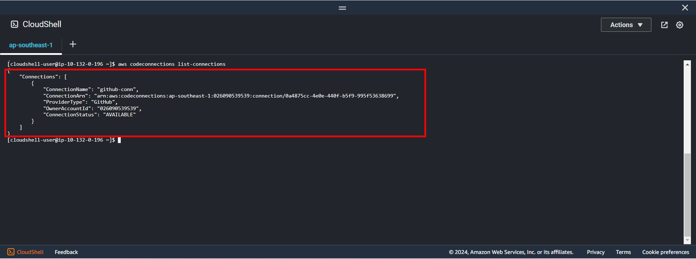

+++
title = 'Clean up resource'
date = 2024-09-07T19:01:58+07:00
draft = false
weight = 12
pre = "<b>5. </b>"
+++

- Find vpcId with cidr when created ```10.10.0.0/16```
```aws ec2 describe-vpcs --filter "Name=cidr, Values=10.10.0.0/16" | grep -oP '"VpcId":\s*"\K[^"]+'```

- Find subnetId ```aws ec2 describe-subnets --filter "Name=vpc-id, Values=vpc-test"``` with vpcId above
  
- Find Ec2 instance id ```aws ec2 describe-instances --filter "Name=subnet-id, Values=subnet-test"
  
### 1. Terminate EC2
```bash
aws ec2 terminate-instances --instance-ids i-test
```
- Check instance terminated
```bash
aws ec2 describe-instances --filter "Name=instance-state-name, Values=terminated"
```

**Result**


{}
Please wait ec2 instance terminated first and then go to next step
{}

---
### 2. Delete VPC
```bash
vi delete-resource.sh
```

```bash
#!/bin/bash

# GET vpc_id
vpc_id=$(aws ec2 describe-vpcs --filter "Name=cidr, Values=10.10.0.0/16" | grep -oP '"VpcId":\s*"\K[^"]+')

# GET IGW id
IGW_id=$(aws ec2 describe-internet-gateways --filters "Name=attachment.vpc-id, Values=${vpc_id}" | grep -oP '"InternetGatewayId":\s*"\K[^"]+')

# detach IGW and vpc
aws ec2 detach-internet-gateway --internet-gateway-id ${IGW_id} --vpc-id ${vpc_id}
echo "Detach IGW successfully"

# delete IGW
aws ec2 delete-internet-gateway --internet-gateway-id ${IGW_id}
echo "Delete IGW successfully"

# GET route table id
rtb_id=$(aws ec2 describe-route-tables --filter "Name=vpc-id, Values=${vpc_id}" | grep -oP '"RouteTableId":\s*"\K[^"]+')

# Delete route
aws ec2 delete-route --route-table-id ${rtb_id} --destination-cidr-block 0.0.0.0/0

# Delete route table id
aws ec2 delete-route-table --route-table-id ${rtb_id}

echo "Delete route and route table successfully"

# GET subnet id 
subnet_id=$(aws ec2 describe-subnets --filter "Name=vpc-id, Values=${vpc_id}" | grep -oP '"SubnetId":\s*"\K[^"]+')

# Delete subnet
aws ec2 delete-subnet --subnet-id ${subnet_id}

echo "Delete subnet successfully"

# Delete vpc
aws ec2 delete-vpc --vpc-id ${vpc_id}

echo "Delete vpc successfully"
```

- Run this command ```bash delete-resource.sh```

---
### 3. Delete codebuild
```aws codebuild delete-project --name project-codebuild-example```

---
### 4. Delete codedeploy
- Delete application name
  - Use this ```aws deploy delete-application --application-name codedeploy-application```
- Delete deployment group
  - Use this ```aws deploy delete-deployment-group --application-name codedeploy-application --deployment-group-name codedeploy-group-name```

---
### 5. Delete codepipeline
```aws codepipeline delete-pipeline --name codepipeline-cli-example```

---
### 6. Delete s3 bucket

- Empty s3 bucket first

```bash
aws s3 rm s3://codepipeline-ap-southeast-1-nntl-example --recursive
```

- Delete s3 bucket

```bash
aws s3api delete-bucket --bucket codepipeline-ap-southeast-1-nntl-example --region ap-southeast-1
```

### 7. Delete github connection
- List connections ```aws codeconnections list-connections```
  
- Delete connections ```aws codeconnections delete-connection --connection-arn ```


