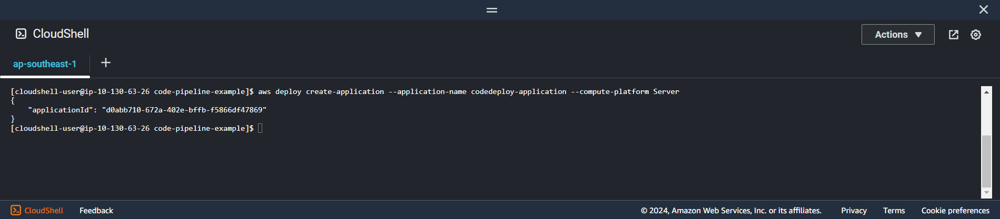

+++
title = 'Create application'
date = 2024-09-07T19:01:58+07:00
draft = false
weight = 1
pre = "<b>5.1. </b>"
+++

1. Create application codedeploy

```console
aws deploy create-application --application-name codedeploy-application --compute-platform Server
```

**Result**



