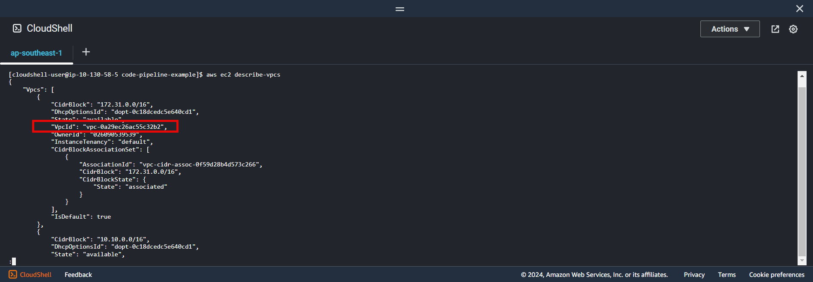
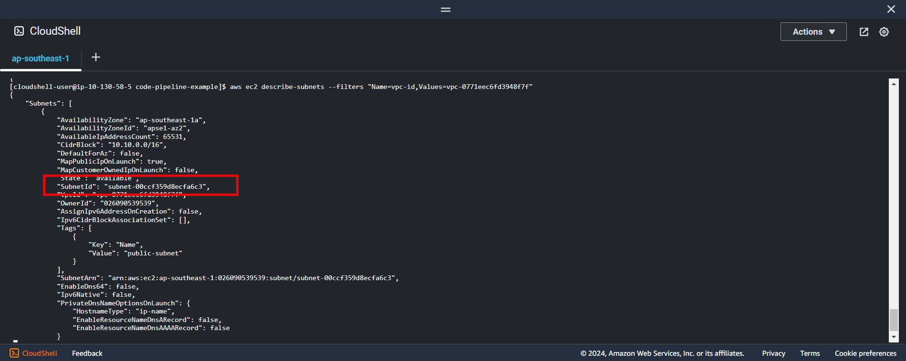
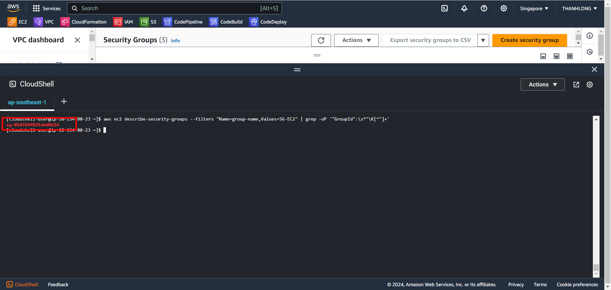
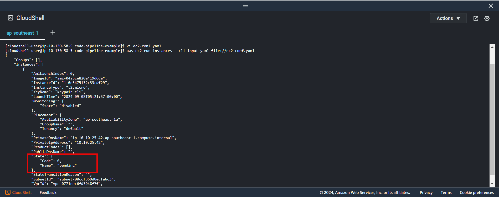
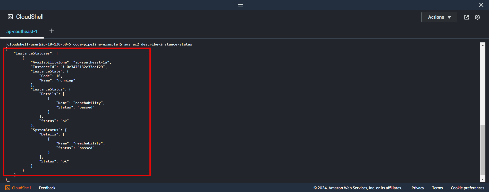

+++
title = 'Create Ec2 config'
date = 2024-09-07T19:01:58+07:00
draft = false
weight = 3
pre = "<b>3.3. </b>"
+++

### 3.3.1. Create Ec2 config:

- Get subnet created in result [Section 2](/create-vpc/config-cloushell/#3-create-vpc-bash) or following this command:
  - Use ```aws ec2 describe-vpcs``` to get vpcId created
    
  - Use ```aws ec2 describe-subnets --filters "Name=vpc-id,Values=vpc-3EXAMPLE" ```
    
- Get security group id created in result [section]([/create-vpc/config-cloushell/#3-create-vpc-bash](/create-vpc/create-security-group/#1-create-security-group)) or following this command:
  - Use ```aws ec2 describe-vpcs``` to get vpcId created
    
  - Use ```aws ec2 describe-security-groups --filters "Name=group-name,Values=SG-EC2" | grep -oP '"GroupId":\s*"\K[^"]+'```
    

- Create ec2 config
```bash
vi ec2-conf.yaml
```

```yaml
ImageId: "ami-04a5ce820a419d6da"
InstanceType: "t2.micro"
SubnetId: "subnet-exampleId"
KeyName: "keypair-cli"
SecurityGroupIds: "sg-exampleId"
IamInstanceProfile:
    Name: "Ec2ProfileName"
TagSpecifications:
    - ResourceType: "instance"
      Tags:
          - Key: "Name"
            Value: "ec2-server"
```

Specifying:

-   SubnetId: Created in section [VPC](#1-create-vpc) or above we got
-   IamInstanceProfile: Created in above section
-   ImageId and InstanceType can be reference
    -   [Instance type](https://aws.amazon.com/ec2/instance-types/)
    -   [Image Id](https://ap-southeast-1.console.aws.amazon.com/ec2/home?region=ap-southeast-1#AMICatalog:)
-   SecurityGroupIds: created in [section](/create-vpc/create-security-group/#1-create-security-group)
  
Run instance ec2:

```console
aws ec2 run-instances --cli-input-yaml file://ec2-conf.yaml
```

**Result**
- State is pending when created

- Check state ec2 instance ```aws ec2 describe-instance-status```
  


