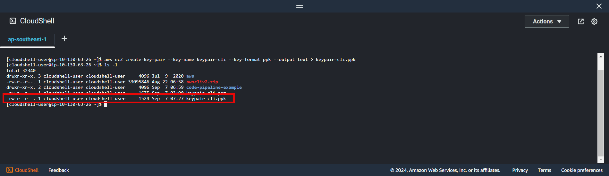
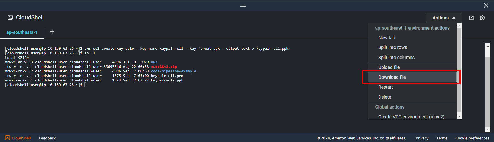
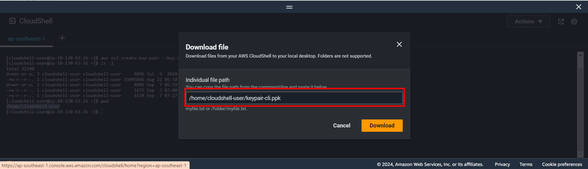

+++
title = 'Create key pair'
date = 2024-09-07T19:01:58+07:00
draft = false
weight = 2
pre = "<b>3.2. </b>"
+++

### Create keypair using for Ec2:


```console
aws ec2 create-key-pair --key-name keypair-cli --key-format ppk --output text > keypair-cli.ppk
```

Specifying:
- --key-format: ppk or pem (pem using for ssh)
- --key-name: User defined

**Result**

Download ```keypair-cli.ppk``` to local machine

Enter path and click download
  


