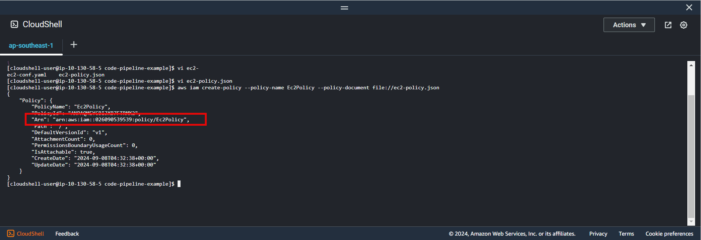
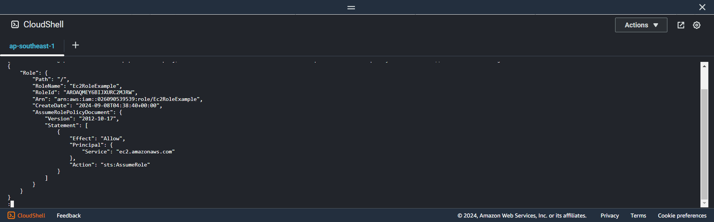
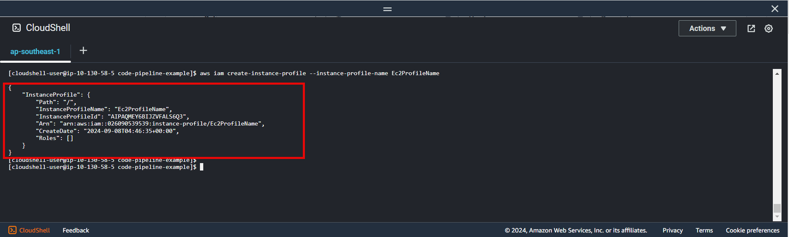
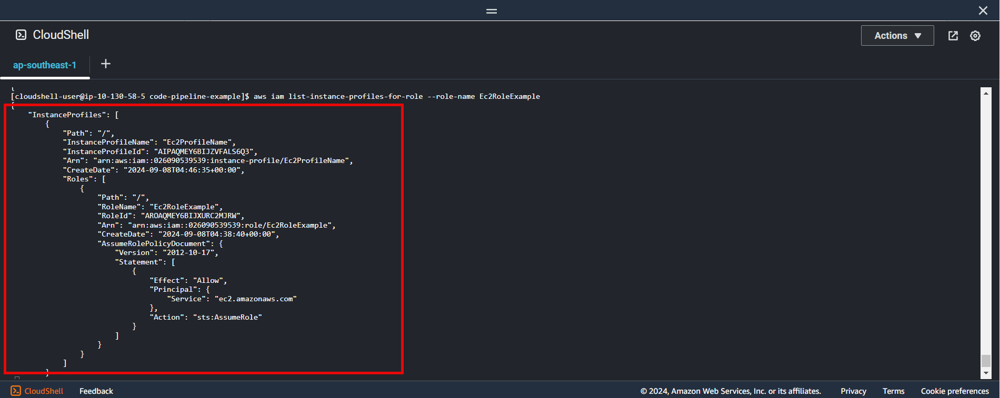

+++
title = 'Create IAM instance profile'
date = 2024-09-07T19:01:58+07:00
draft = false
weight = 1
pre = "<b>3.1. </b>"
+++

### 3.1.1. Create ec2 policy:

```bash
vi ec2-policy.json
```

```json
{
    "Version": "2012-10-17",
    "Statement": [
        {
            "Effect": "Allow",
            "Action": ["ec2:*"],
            "Resource": "*"
        }
    ]
}
```
Run this command:

```bash
aws iam create-policy --policy-name Ec2Policy --policy-document file://ec2-policy.json
```

**Result**


{}
Use arn value for [section 3.1.3](#313-attach-role-policy-and-add-role-to-instance-profile)
{}


### 3.1.2. Create ec2 role:

```bash
vi ec2-role-document.json
```

```json
{
    "Version": "2012-10-17",
    "Statement": [
        {
            "Effect": "Allow",
            "Principal": {
                "Service": "ec2.amazonaws.com"
            },
            "Action": "sts:AssumeRole"
        }
    ]
}
```
Run this command:
```bash
aws iam create-role --role-name Ec2RoleExample --assume-role-policy-document file://ec2-role-document.json
```

**Result**


### 3.1.3. Attach role policy and add role to instance profile

- Attach policy to role
```bash
aws iam attach-role-policy --role-name Ec2RoleExample --policy-arn arn:aws:iam::xxxxxxxxxx:policy/Ec2Policy
```
- Create instance profile
```bash
aws iam create-instance-profile --instance-profile-name Ec2ProfileName
```
**Result**



- Add role to instance profile
```bash
aws iam add-role-to-instance-profile --role-name Ec2RoleExample --instance-profile-name Ec2ProfileName
```

- Check instance profile created by role name
```bash
aws iam list-instance-profiles-for-role --role-name Ec2RoleExample
```

**Result**



