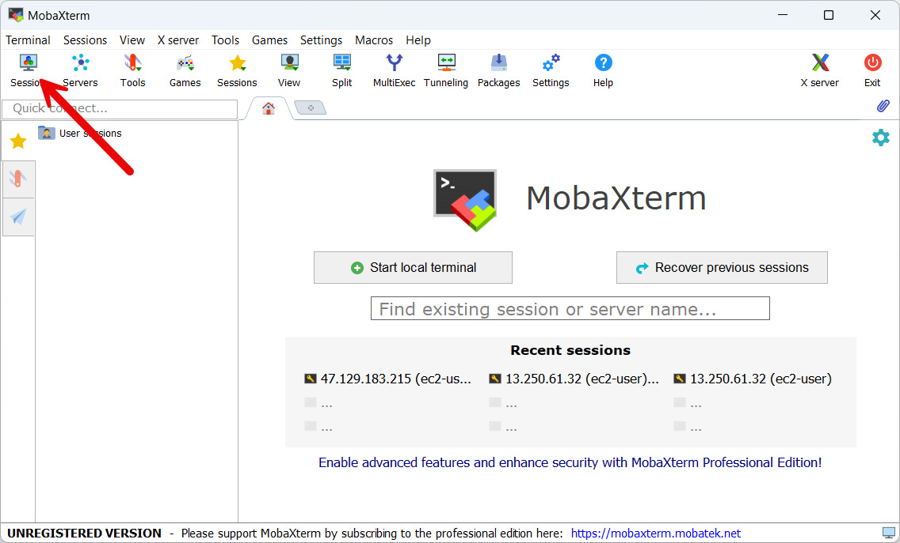
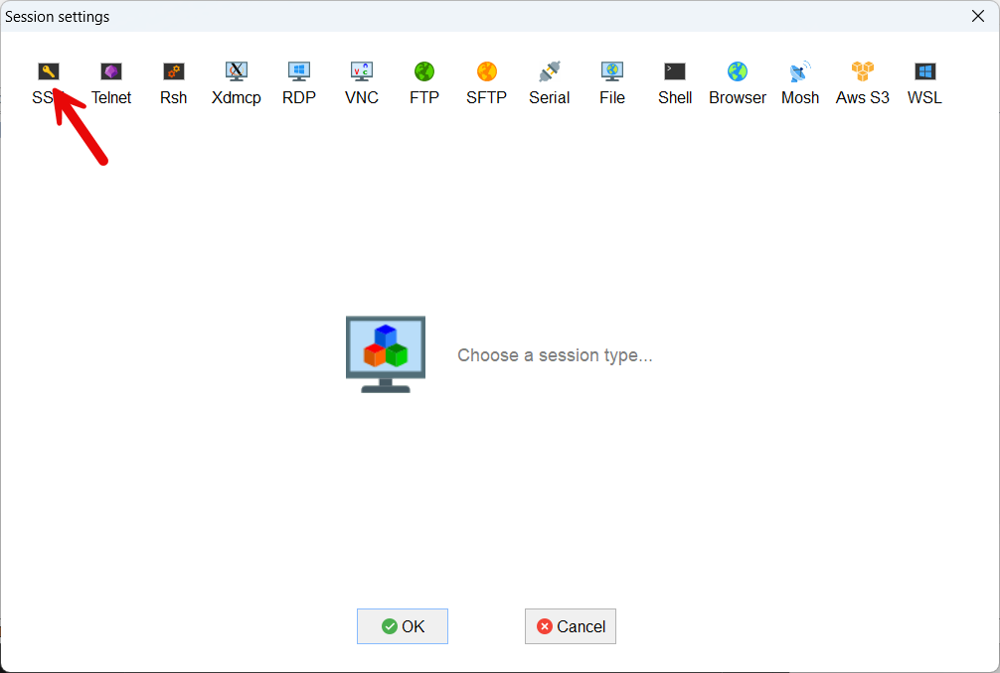
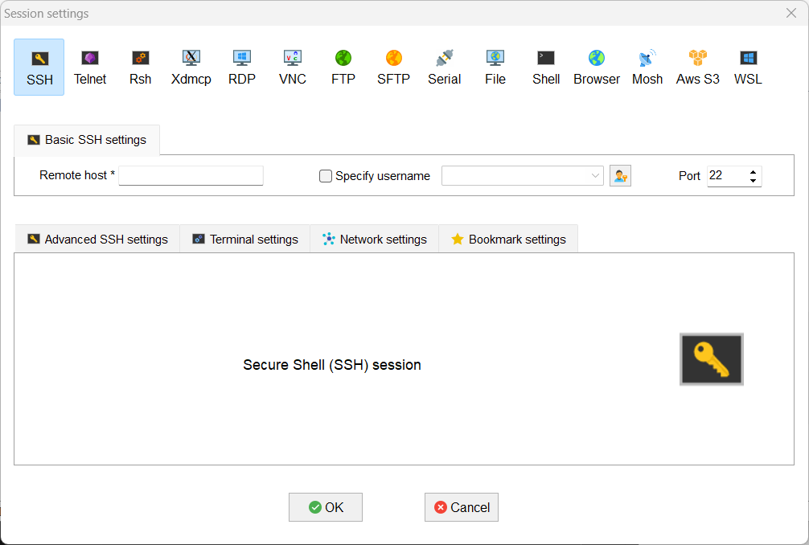
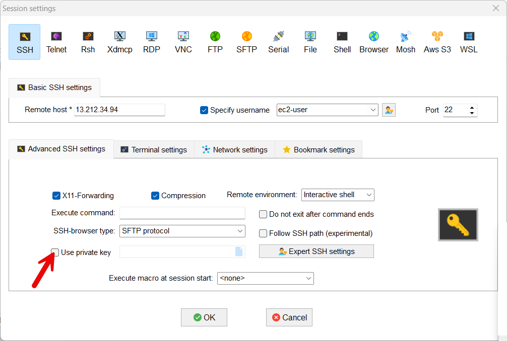
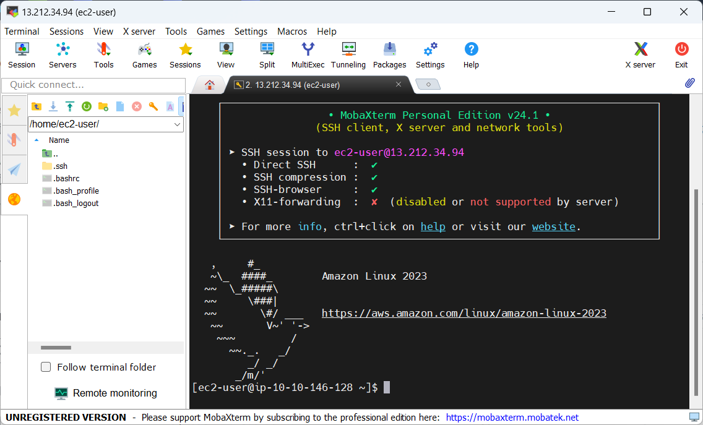
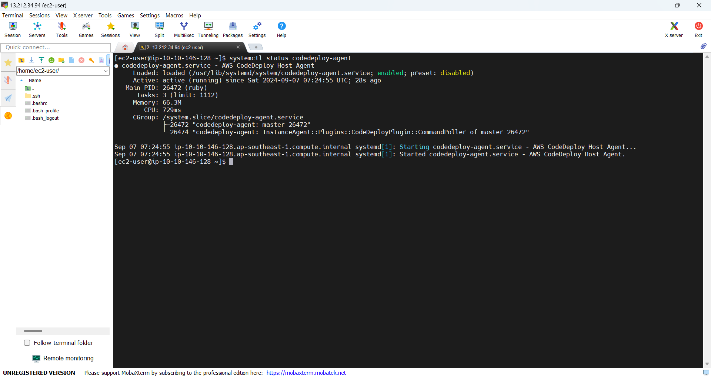

+++
title = 'Install codedeploy agent on EC2 instance'
date = 2024-09-07T19:01:58+07:00
draft = false
weight = 3
pre = "<b>3.4. </b>"
+++

### 1. Connect EC2 install with MobaXterm:
- Open MobaXterm and choose Session
  
- Choose SSH
  
- Remote host: 
  - Public IP in previous section
  - Tick Specify username and press ```ec2-user```
  
  - Choose tab Advanced SSH settings then tick checkbox Use private key and choose file ```keypair-cli.ppk``` when use downloaded in [section](/create-ec2/create-keypair/#create-keypair-using-for-ec2)  and press ok 
    
  - Connect success
    

### 2. Install code deploy agent:
- Following this [guide](https://docs.aws.amazon.com/codedeploy/latest/userguide/codedeploy-agent-operations-install-linux.html)

```
sudo yum update
```
```
sudo yum install ruby
```
```
sudo yum install wget
```
```
cd /home/ec2-user
```
Download the CodeDeploy agent installer:
```
wget https://aws-codedeploy-ap-southeast-1.s3.ap-southeast-1.amazonaws.com/latest/install
```

```
chmod +x ./install
```

```
sudo ./install auto
```

```
systemctl status codedeploy-agent
```

**Result**



