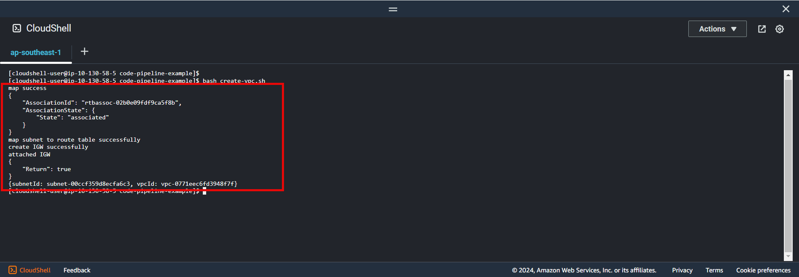

+++
title = 'Configure with Cloudshell'
date = 2024-09-07T19:01:58+07:00
draft = false
weight = 1
url = '/create-vpc/config-cloushell'
pre = "<b>2.1. </b>"
+++

### 1. Create file config for vpc

```bash
vi vpc-conf.yaml
```

```yaml
# config name, cidr block for vpc
CidrBlock: "10.10.0.0/16"
TagSpecifications:
    - ResourceType: "vpc"
      Tags:
          - Key: "Name"
            Value: "custom-vpc-for-ci-cd"
```

If you use more property or understand information, please use a reference document. [Cli VPC Document!](https://docs.aws.amazon.com/cli/latest/reference/ec2/create-vpc.html)

### 2. Create file config for public subnet

#### 2.1. Find AzId in region

```bash
aws ec2 describe-availability-zones
```

**Result**
```JSON
{
    "AvailabilityZones": [
        {
            "State": "available",
            "OptInStatus": "opt-in-not-required",
            "Messages": [],
            "RegionName": "ap-southeast-1",
            "RegionName": "ap-southeast-1",
            "ZoneName": "ap-southeast-1a",
            "ZoneId": "apse1-az2",
            "GroupName": "ap-southeast-1",
            "NetworkBorderGroup": "ap-southeast-1",
            "ZoneType": "availability-zone"
        },
        {
            "State": "available",
            "OptInStatus": "opt-in-not-required",
            "Messages": [],
            "OptInStatus": "opt-in-not-required",
            "Messages": [],
            "RegionName": "ap-southeast-1",
            "ZoneName": "ap-southeast-1b",
            "ZoneId": "apse1-az1",
            "GroupName": "ap-southeast-1",
            "NetworkBorderGroup": "ap-southeast-1",
            "ZoneType": "availability-zone"
        },
        {
            "State": "available",
            "OptInStatus": "opt-in-not-required",
            "Messages": [],
            "RegionName": "ap-southeast-1",
            "ZoneName": "ap-southeast-1c",
            "ZoneId": "apse1-az3",
            "GroupName": "ap-southeast-1",
            "NetworkBorderGroup": "ap-southeast-1",
            "ZoneType": "availability-zone"
        }
    ]
}
```

#### 2.2. Create subnet public config

```bash
vi public-subnet-conf.yaml
```

```yaml
# config name, AZid and cidr block for subnet
TagSpecifications:
    - ResourceType: "subnet"
      Tags:
          - Key: "Name"
            Value: "public-subnet"
AvailabilityZoneId: "apse1-az2"
CidrBlock: "10.10.0.1/16"
```

If you use more property or understand information, please use a reference document. [Cli create subnet!](https://docs.aws.amazon.com/cli/latest/reference/ec2/create-subnet.html)

### 3. Create vpc bash

```bash
vi create-vpc.sh
```

```bash
#!/bin/bash
#create vpc
vpc_id=$(aws ec2 create-vpc --cli-input-yaml file://vpc-conf.yaml | grep -oP '"VpcId":\s*"\K[^"]+')

#create subnet
subnet_id=$(aws ec2 create-subnet --cli-input-yaml file://public-subnet-conf --vpc-id ${vpc_id}| grep -oP '"SubnetId":\s*"\K[^"]+')

#map assign ip address when launch
aws ec2 modify-subnet-attribute --subnet-id ${subnet_id} --map-public-ip-on-launch
echo "map success"

#create route table
route_table_id=$(aws ec2 create-route-table --cli-input-yaml file://route-table-conf.yaml --vpc-id ${vpc_id} | grep -oP '"RouteTableId":\s*"\K[^"]+')

#map subnet to route table
aws ec2 associate-route-table --route-table-id ${route_table_id} --subnet-id ${subnet_id}
echo "map subnet to route table successfully"

#create IGW
IGW_id=$(aws ec2 create-internet-gateway --tag-specifications "ResourceType=internet-gateway, Tags=[{Key=Name, Value=custom-internet-gateway}]" | grep -oP '"InternetGatewayId":\s*"\K[^"]+')
echo "create IGW successfully"

# attach IGW to VPC
aws ec2 attach-internet-gateway --vpc-id ${vpc_id} --internet-gateway-id ${IGW_id}
echo "attached IGW"

# create route for IGW to Internet
aws ec2 create-route --route-table-id ${route_table_id} --gateway-id ${IGW_id} --destination-cidr-block 0.0.0.0/0

echo {"subnetId": ${subnet_id}, "vpcId": ${vpc_id}}
```

Run this command in cloudshell

```console
bash create-vpc.sh
```

**Result**



