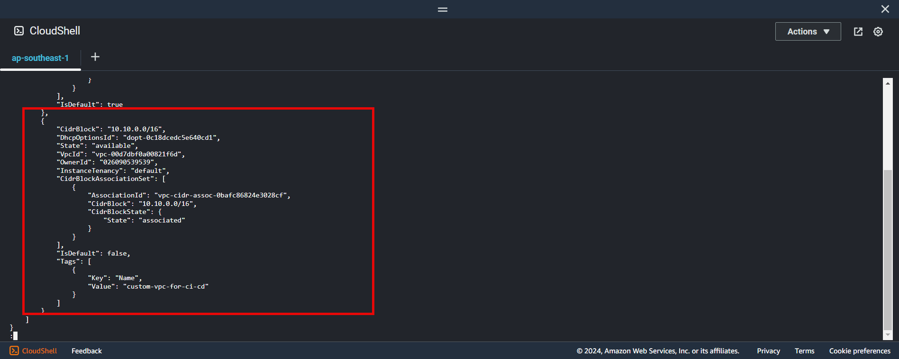
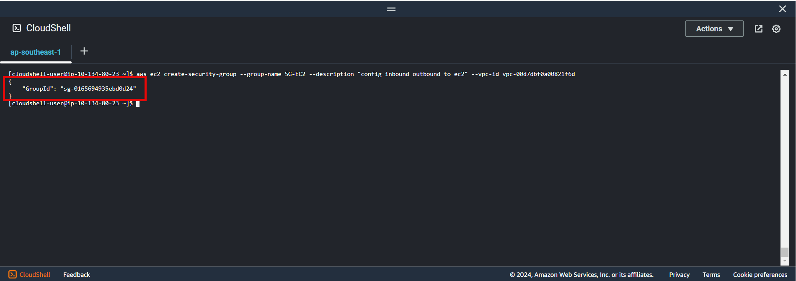
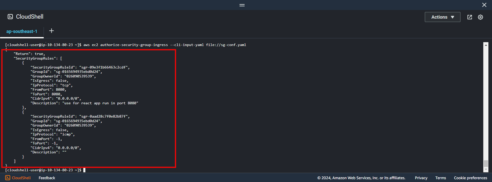

+++
title = 'Create security group'
date = 2024-09-07T19:01:58+07:00
draft = false
weight = 2
pre = "<b>2.2. </b>"
+++

### 1. Create security group
```bash
aws ec2 create-security-group --group-name SG-EC2 --description "config inbound outbound to ec2" --vpc-id example
```

Specifying:
- **--vpc-id**: created in [result](/create-vpc/config-cloushell/#3-create-vpc-bash)

- Or if want to know can use this command ```aws ec2 describe-vpcs```
    

**Result**


---
### 2. Edit inbound rules

- Create config file with group name in result above
```bash
vi sg-conf.yaml
```

```yaml
GroupId: "sg-example"
IpPermissions:
    - IpProtocol: "tcp"
      FromPort: 8080
      ToPort: 8080
      IpRanges:
          - CidrIp: "0.0.0.0/0"
            Description: "use for react app run in port 8080"
    - IpProtocol: "icmp"
      FromPort: -1
      ToPort: -1
      IpRanges:
          - CidrIp: "0.0.0.0/0"
            Description: ""
```

- GroupId: from result above

[Read more SG config !](https://docs.aws.amazon.com/cli/latest/reference/ec2/authorize-security-group-ingress.html)

- Run this command ```aws ec2 authorize-security-group-ingress --cli-input-yaml file://sg-conf.yaml ```

**Result**



