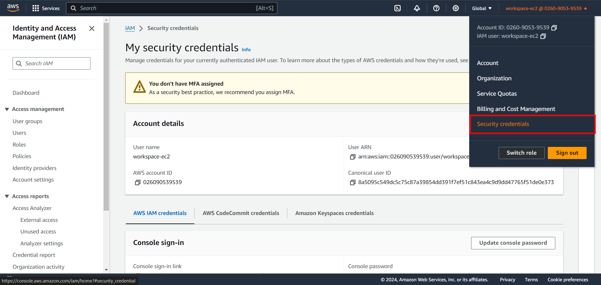
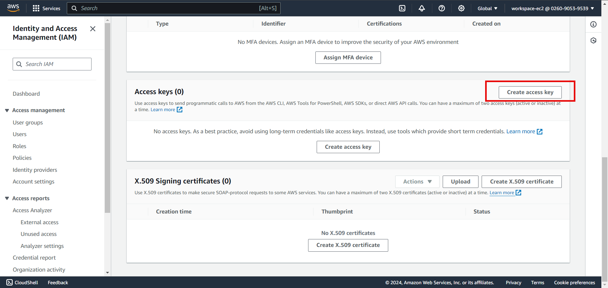
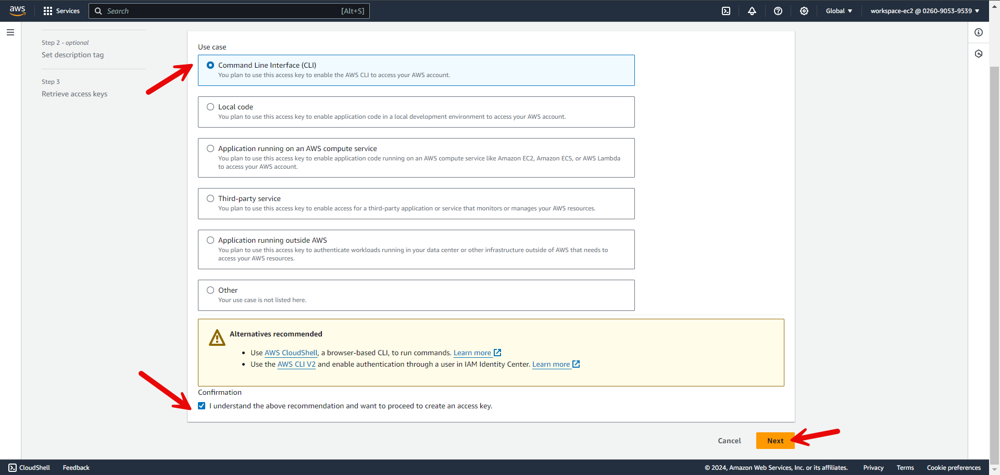
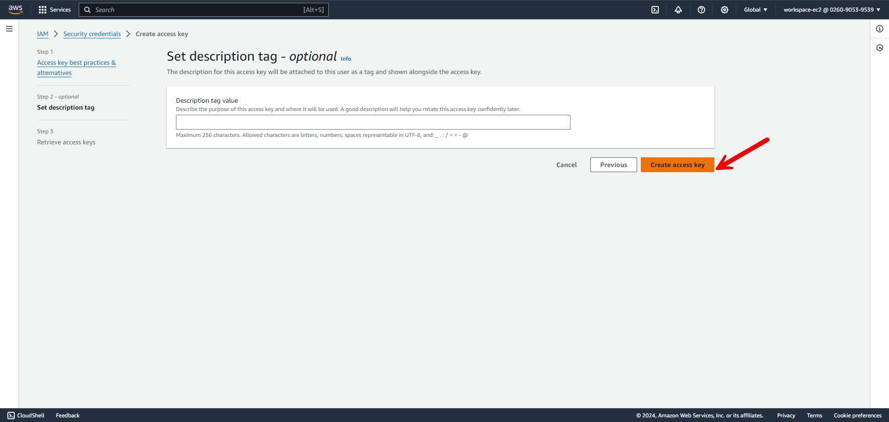
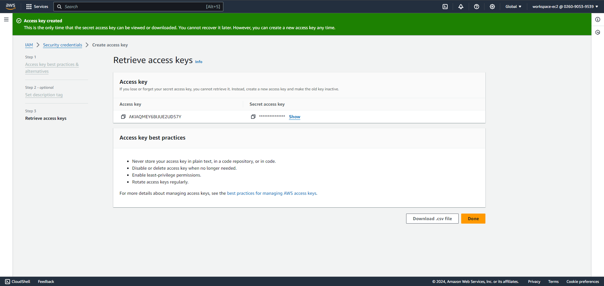
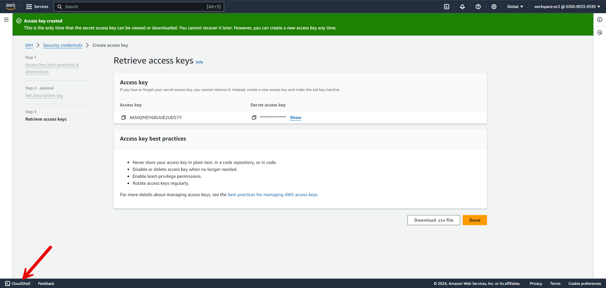
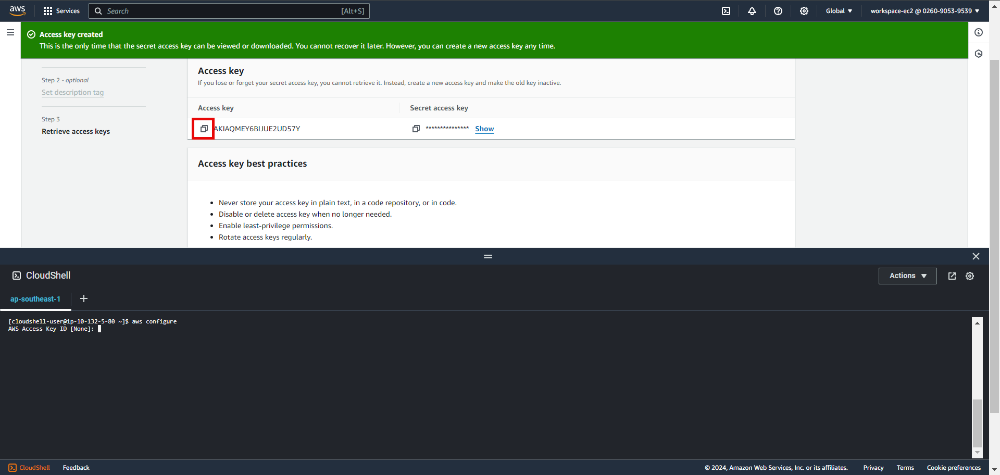
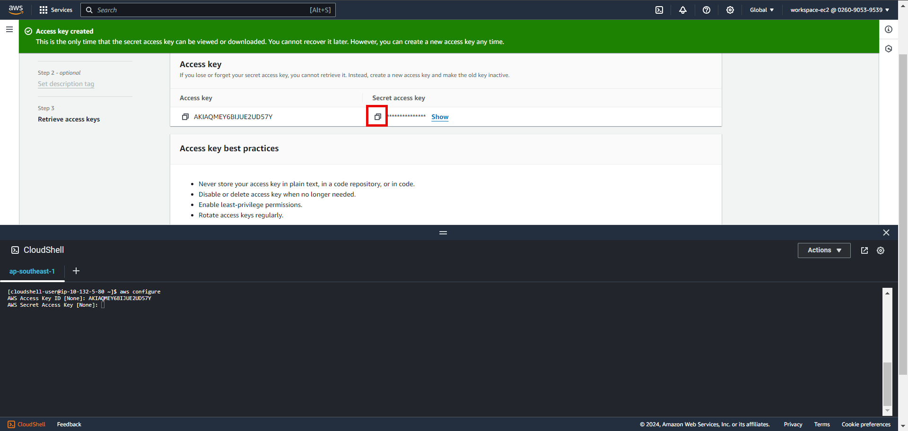
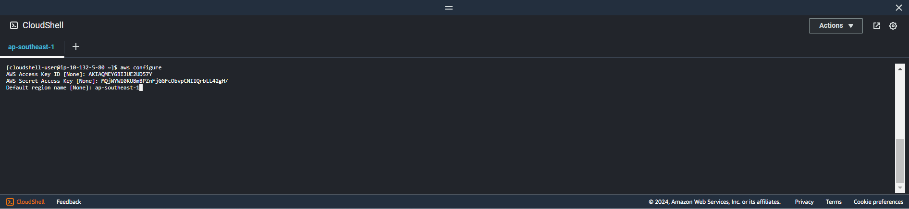

+++
title = 'Cloud shell'
date = 2024-09-07T19:01:58+07:00
weight = 1
url = '/pre-install/cloudshell'
pre = "<b>1.1. </b>"
+++

#### Create access key in IAM Console to use Cloudshell:

1. Choose **Security credentials** from top right menu
   
2. Choose **Create access key**
   

3.  Choose from top to bottom and click Next
    
4.  Click create access key
    
5.  Result
    
6.  Open cloud shell
    
7.   Run command `aws configure`
8.   Copy **access key** and paste in cli
    
9.   Copy **secret access key** and paste in cli
    
10.    Press region default name (ex: **ap-southeast-1**)
    
11.   Enter 2 times and done this step
