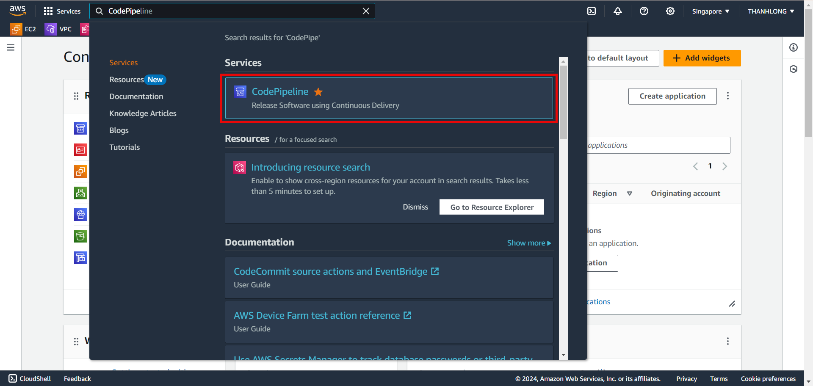
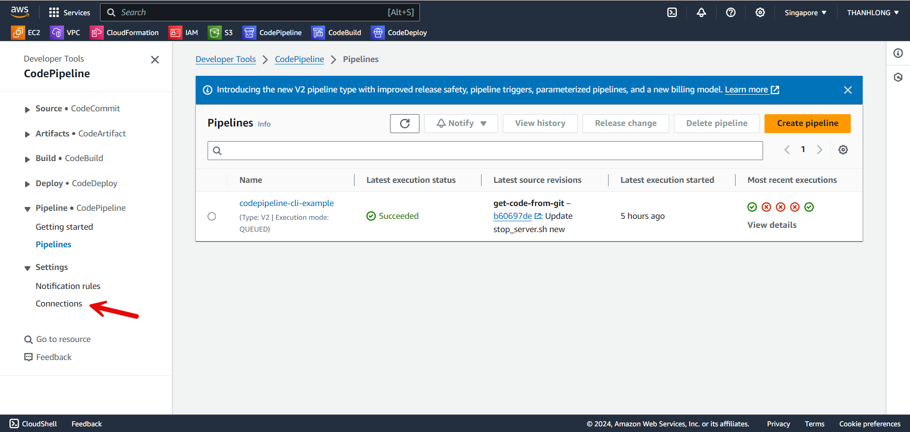
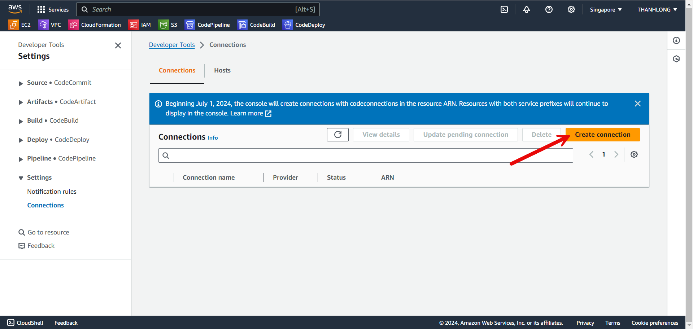
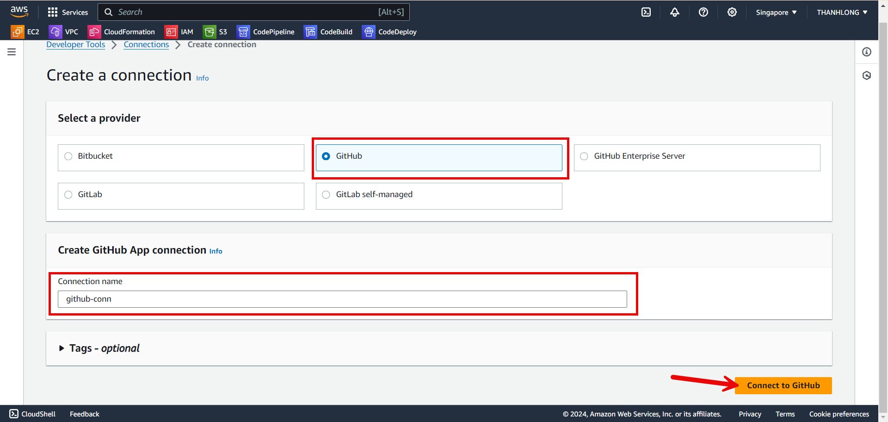
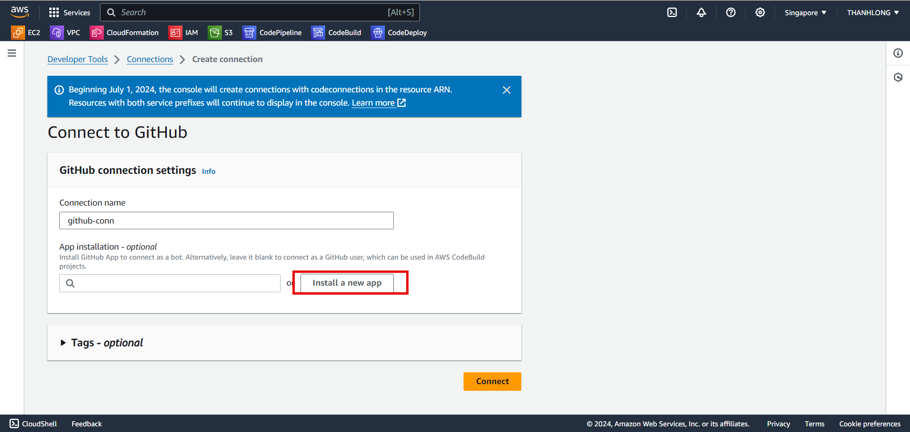
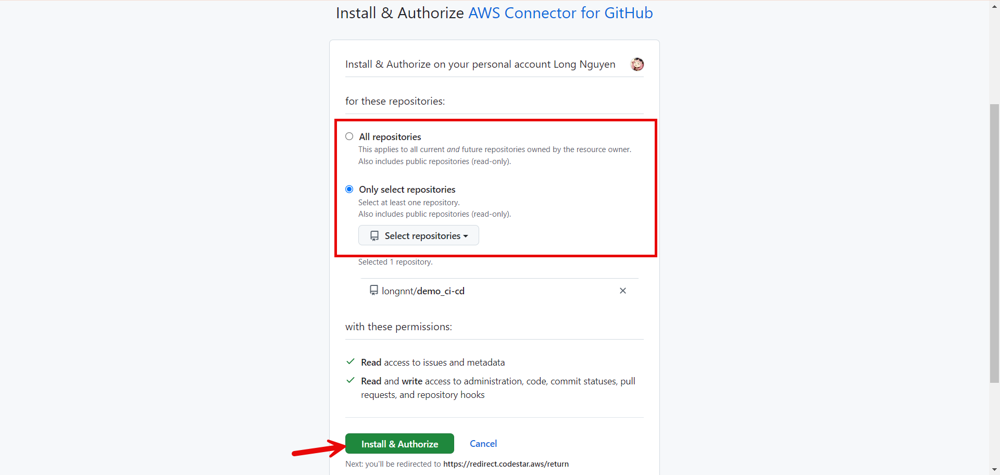
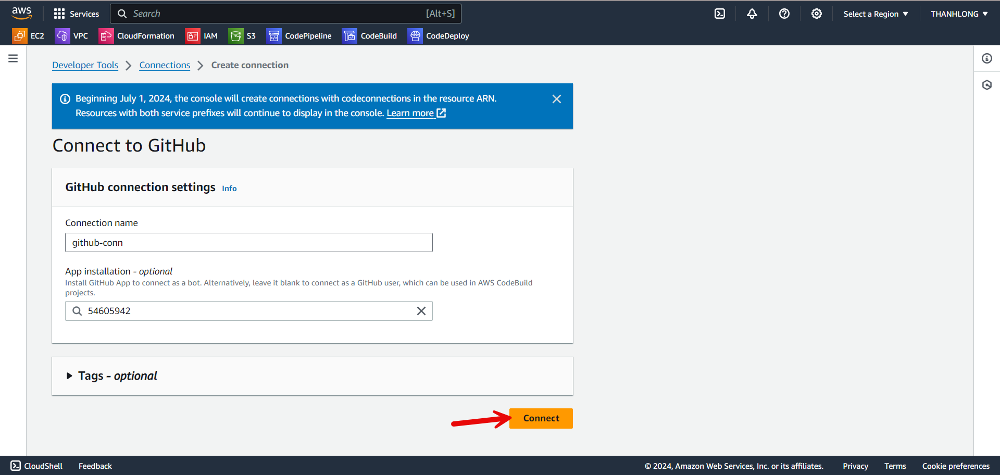
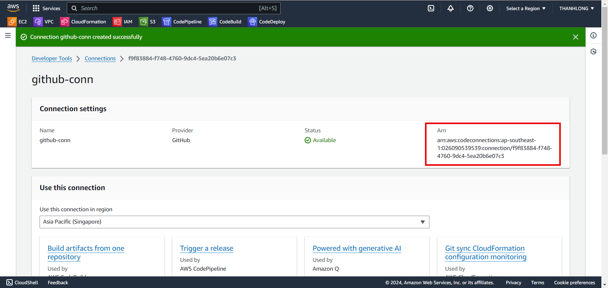

+++
title = 'Create connection to github'
date = 2024-09-07T20:59:39+07:00
url = '/pre-install/connect-github'

+++
#### Create connection to github using console:
- Go to Codepipeline service from homepage
    
- Choose connections
    
- Choose create connections
  
- Choose Github in tab select a provider and create connection name (ex: ```github-conn```)
    
- Choose Install a new app
  
- Navigate to github config
  - Can choose between All Or Only Select repositories then press Install & Authorize
  
- Choose connect
  
**Result**


{}
Arn used to in code pipeline step
{}