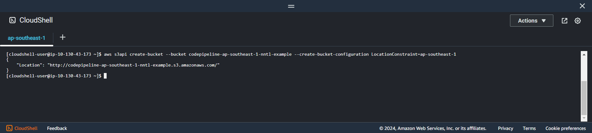
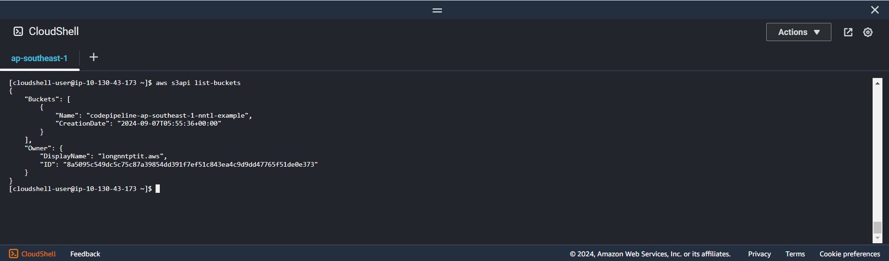

+++
title = 'Create S3 bucket'
date = 2024-09-07T19:02:03+07:00
weight = 2
url = '/pre-install/create-s3'
pre = "<b>1.2. </b>"
+++

#### Create s3 bucket using cli:

1. Create s3 bucket
    ```bash
    aws s3api create-bucket --bucket codepipeline-ap-southeast-1-nntl-example --create-bucket-configuration LocationConstraint=ap-southeast-1
    ```

    Specifying:

    -   **--bucket**: Name of bucket (ex: ```codepipeline-ap-southeast-1-nntl-example```)
    -   **--create-bucket-configuration**: Location-create-bucket

    **Result**
    

2. Check bucket exist using `aws s3api list-buckets`
